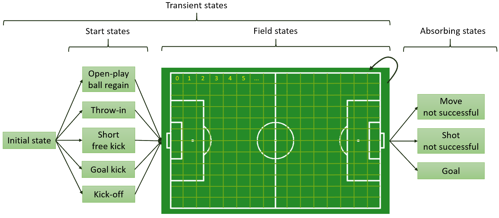
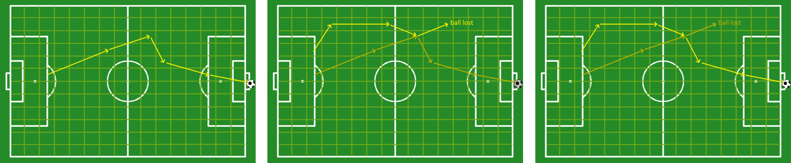

# Markovsoccer
Markovsoccer is a Python package to construct and inspect team models representing the offensive behaviour of soccer
teams. In particular, it provides a function to build a team model based on event stream data of that team. This model
represents their ball possession sequences. The team model is able to capture the sequential nature of the game and has
the ability to generalize over the historical actions that a team has performed in the past. This package implements the
calculation of several numerical features to analyze the playing style of teams based on these models. These features
are related to a team's preference for certain locations, their preference for certain sequences, their directness of
play, and their ability to create shooting opportunities. 

## Core Features
- **Construct Team Models**: implementation of a function to construct team models based on the 
  (vendor-independent) 
  SPADL event stream data format.
- **Analyze Playing Style**: implementation of several numerical features to analyze the offensive playing style of 
  soccer teams based on these team models.

## Installation
The recommended way to install this package is using pip. The latest version officially supports Python versions 3.8 - 
3.10.

```
pip install markovsoccer
```

The [public-notebooks](./public-notebooks) folder contains several demos to get started.

## Benefits of the Team Model
The use of the intermediate team models to analyze the playing style of teams has two advantages:
- It captures the sequential aspect of the game.
- It has the ability to generalize over the historical actions that a team has performed in the past.

**Overview of the Team Model:** The figure below provides an overview of the states and transitions of the team 
model. Each transition is associated with a team-dependent probability. This probability is equal to the historical 
frequency of the corresponding action by that team.



**Generalization:** The generalization ability stems from the assumption that if a team has a high likelihood of moving 
the ball from position A to B, and also a high likelihood of moving the ball prom B to C, then this team is assumed to
also have a high likelihood of consecutively moving the ball from A to B to C. This assumption allows the model to
derive new ways how a team can score a goal, arrive at a shot, or move the ball to a particular location. This is
done by interleaving historical ball possession sequences. By doing so, it is hypothesized that analysis of the playing
style based on the model is more reliable. As an example, playing style analysis based on raw event stream data only has
a small number of shots and goals which can be analyzed, leading to skewed results. However, analysis based on the model
can take into account (tens of) thousands of ways to arrive at a shot or score a goal, each which their own probability.
This leads to a more all-encompassing view and less skewed results.

The figure below visualizes the generalization ability. Imagine a first sequence representing a goal as in the left
image. Then image a second sequence ending in a ball loss as in the middle image. The model will then be able to derive
a new way how a team can score a goal by interleaving these two sequences. The resulting sequence is shown in the right 
image.



**Probabilistic Model Checking:** The team model is a discrete-time Markov chain and can be used for probabilistic 
model checking. In particular, this package provides functionality to write each team model to disk as a PRISM file 
for use in the [PRISM](https://www.prismmodelchecker.org/) model checker. Examples can be found in the 
[public-notebooks](./public-notebooks) folder.

## Research

If you use this package in your research, please consider citing the following paper:

- Clijmans, Jeroen, Maaike Van Roy, and Jesse Davis. **Looking Beyond the Past: Analyzing the Intrinsic Playing Style 
  of Soccer Teams**. European Conference on Machine Learning and Principles and Practice of Knowledge Discovery in 
  Databases ECML PKDD 2022, 2022. [ [pdf](https://2022.ecmlpkdd.org/wp-content/uploads/2022/09/sub_1025.pdf) |
  [bibtex](./docfiles/citation.bib) ]